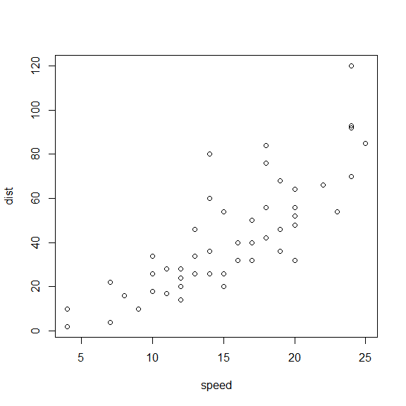

# R Markdown {#nextsteps .emphasized}

This is an R Markdown document. Markdown is a simple formatting syntax for authoring HTML, PDF, and MS Word documents. For more details on using R Markdown see <http://rmarkdown.rstudio.com>.

When you click the **Knit** button a document will be generated that includes both content as well as the output of any embedded R code chunks within the document. You can embed an R code chunk like this:

### Plot of the cars Dataset


```r
plot(cars)
```

<!-- -->

# Including Plots

You can also embed plots, for example:

### Plot of the Presure Dataset

<!-- -->

Note that the `echo = FALSE` parameter was added to the code chunk to prevent printing of the R code that generated the plot.

# A non-numbered list:

* Breakfast
    - food
         + eggs
         + toast
         + bacon
     - drink
         + apple juice
* Lunch
    - taco
* Dinner
    - baked chicken
    - broccoli
    - rice

# a simple equation

$$y=at^{b}e^{-ct}$$
